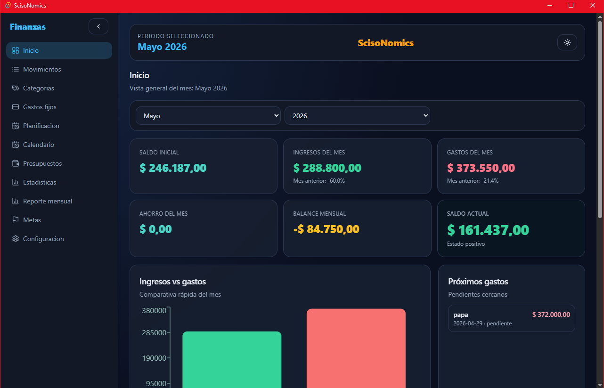
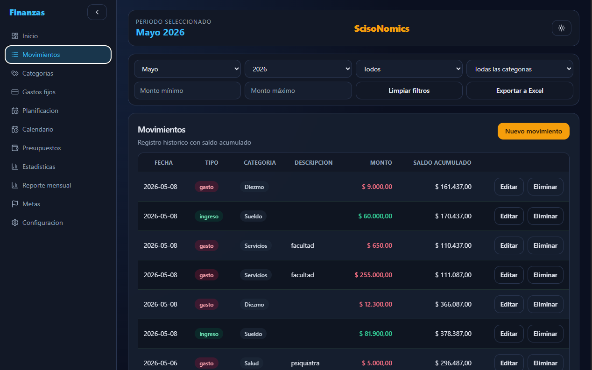
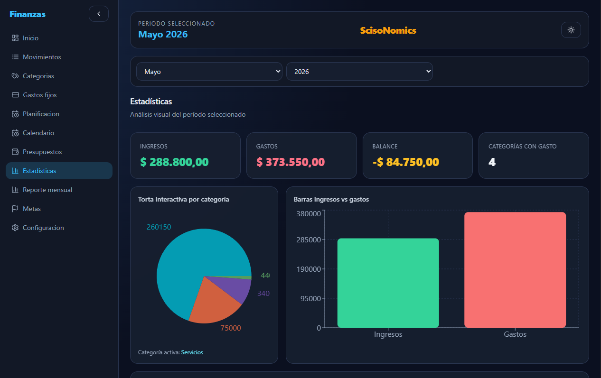
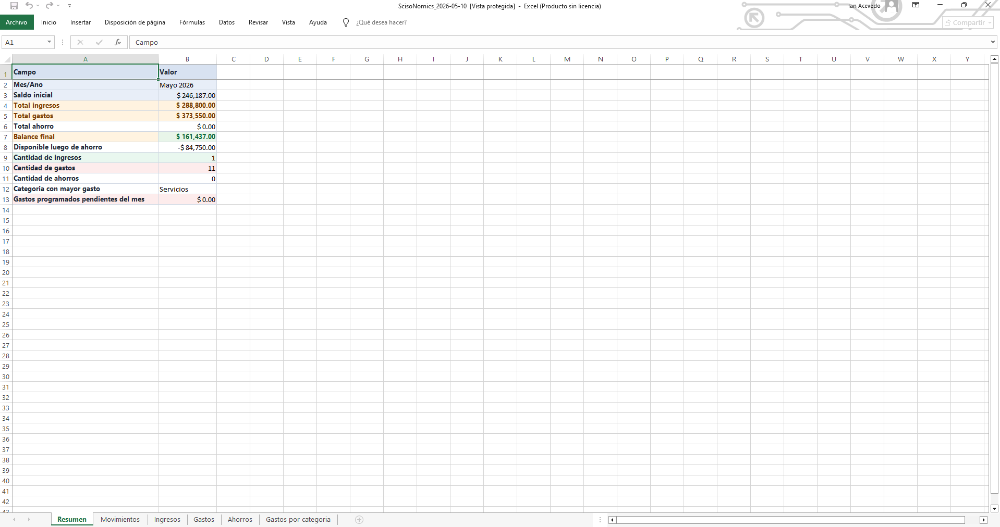

# ScisoNomics

ScisoNomics es una aplicación de escritorio para gestión de finanzas personales.

Permite registrar ingresos, gastos, ahorros e inversiones, organizar categorías, controlar presupuestos mensuales, crear metas de ahorro, administrar gastos fijos, visualizar estadísticas, filtrar movimientos y exportar reportes a Excel.

La aplicación funciona de forma local, sin necesidad de conexión a internet, y almacena los datos en una base SQLite dentro del equipo del usuario.

---

## Descargar

La versión estable para Windows está disponible en la sección de Releases:

[Descargar ScisoNomics v1.6.0](../../releases/tag/v1.6.0)

---

## Características principales

- Registro de ingresos, gastos, ahorros e inversiones.
- Categorías personalizadas.
- Dashboard de inicio con resumen financiero mensual.
- Cards de ingresos, gastos, balance, ahorros e inversiones.
- Últimos movimientos desde la pantalla de inicio.
- Accesos rápidos a funciones principales.
- Presupuestos mensuales con progreso, disponible y estados visuales.
- Metas de ahorro con progreso, monto faltante y porcentaje alcanzado.
- Gastos fijos con resumen mensual, próximos vencimientos y estados visuales.
- Calendario de movimientos.
- Filtros de movimientos por fechas exactas, tipo, categoría, monto y orden.
- Estadísticas por períodos: mes actual, últimos 3 meses, últimos 6 meses y año actual.
- Reportes mensuales.
- Exportación de reportes a Excel por rango de fechas.
- Reporte Excel mejorado visualmente.
- Exportación Excel con opción de elegir ubicación.
- Creación de copias de seguridad locales.
- Restauración segura de copias de seguridad.
- Validación de copias antes de restaurar.
- Creación automática de una copia previa antes de restaurar datos.
- Advertencias para conservar correctamente los archivos de copia de seguridad.
- Guías contextuales por sección para nuevos usuarios.
- Opción para volver a ver las guías desde Configuración.
- Pantalla de inicio mientras se prepara la aplicación y la base de datos local.
- Base de datos SQLite local.
- Creación automática de base de datos en primera instalación.
- Backend local embebido como sidecar.
- Modo claro y modo oscuro.
- Aplicación instalable para Windows.

---

## Stack técnico

- Frontend: Next.js, React, Tailwind CSS
- Desktop: Tauri
- Backend: FastAPI
- Base de datos: SQLite
- Empaquetado backend: PyInstaller
- Exportación Excel: OpenPyXL

---

## Arquitectura

ScisoNomics está construida como una aplicación desktop con frontend web embebido y backend local.

Tauri ejecuta la interfaz hecha con Next.js y levanta un backend FastAPI local como sidecar. El frontend se comunica con ese backend mediante una API local, y los datos se guardan en una base SQLite dentro del equipo del usuario.

Al iniciar la aplicación, ScisoNomics verifica que el backend local y la base de datos estén listos antes de cargar las pantallas principales. Esto evita errores de carga durante el arranque.

Base de datos local:

`%LOCALAPPDATA%\RegistroFinanzas\data\finanzas.db`

Logs técnicos:

`%LOCALAPPDATA%\ScisoNomics\logs`

---

## Capturas

### Inicio

### Movimientos

### Estadísticas

### Exportación a Excel

---

## Instalación

1. Ir a la sección de Releases.
2. Descargar `ScisoNomics_1.6.0_x64-setup.exe`.
3. Ejecutar el instalador.
4. Abrir ScisoNomics desde el acceso directo o desde el menú de inicio.

En la primera apertura, la aplicación crea automáticamente la base de datos local.

---

## Estado del proyecto

Versión estable actual: `v1.6.0`

Funcionalidades validadas:

- Instalación en Windows.
- Creación automática de base de datos.
- Arranque controlado con verificación del backend local.
- Registro de movimientos.
- Gestión de categorías.
- Dashboard financiero.
- Presupuestos con progreso y estados visuales.
- Metas de ahorro con progreso y estados visuales.
- Gastos fijos con próximos vencimientos y estados visuales.
- Calendario de movimientos.
- Filtros de movimientos.
- Estadísticas por períodos.
- Exportación a Excel por rango de fechas.
- Creación de copias de seguridad.
- Restauración segura de copias de seguridad.
- Guías contextuales por sección.
- Funcionamiento offline.

---

## Guías de uso

ScisoNomics incluye guías contextuales que aparecen la primera vez que se ingresa a cada sección principal.

Estas guías explican brevemente para qué sirve cada pantalla y ayudan al usuario a comenzar a usar la aplicación sin necesidad de configuración previa.

Desde Configuración se pueden volver a mostrar las guías cuando sea necesario.

---

## Copias de seguridad

ScisoNomics permite crear y restaurar copias de seguridad locales.

Al restaurar una copia, la aplicación valida que el archivo sea una base de datos compatible y crea automáticamente una copia previa de los datos actuales antes de reemplazarlos.

Se recomienda conservar el nombre y la extensión `.db` del archivo de copia de seguridad.

---

## Posibles mejoras futuras

- Importación desde plantilla oficial de Excel o CSV.
- Backups automáticos configurables.
- Restauración guiada con historial de copias.
- Mejora visual de reportes exportados.
- Reporte anual.
- Sistema de actualización automática.
- Sincronización cloud opcional.
- Versión mobile.

---

## Autor

Desarrollado por Ian Acevedo.